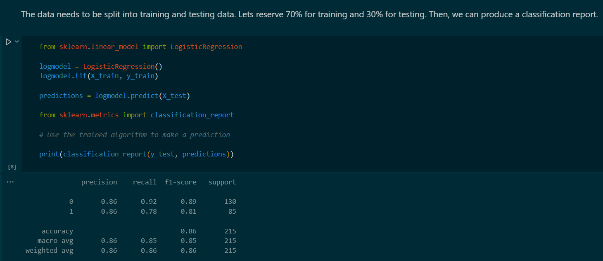
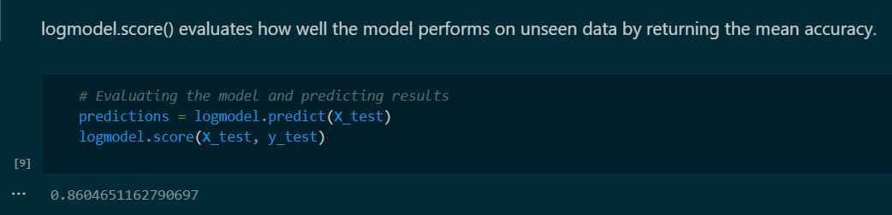

# Titanic ML Project
A machine learning model that predicts whether YOU would have survived the Titanic disaster!  

### [Kaggle Titanic Dataset](https://www.kaggle.com/c/titanic)

---

<h2>Description</h2>

This project uses the famous Titanic dataset to build and evaluate a machine learning model that predicts passenger survival. I implemented **logistic regression** with scikit-learn, trained it on historical passenger data, and tested it using unseen data. The model can also evaluate custom passenger profiles (e.g., "Would a 30-year-old female in 1st class with 1 child survive?").  

---


<h2>Languages, Libraries, and Tools Used</h2>

- <b>Python</b>  
- <b>Pandas</b>  
- <b>NumPy</b>  
- <b>scikit-learn</b>  
- <b>Matplotlib</b> / <b>Seaborn</b> (for visualization)

<h2>Environments Used</h2>

- <b>Jupyter Notebook</b>  
- <b>Python 3</b>  

<h2>Program walk-through:</h2>

<p align="center">
Collecting data: <br/>

<br />
<br />
Cleaning data:  <br/>

<br />
<br />
Choosing a model: <br/>

<br />
<br />
Training the model:  <br/>

<br />
<br />
Evaluating the model:  <br/>

<br />
<br />
Testing the model:  <br/>

<br />
<br />
</p>

<!--
 ```diff
- text in red
+ text in green
! text in orange
# text in gray
@@ text in purple (and bold)@@
```
--!>
